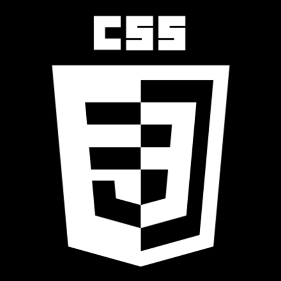
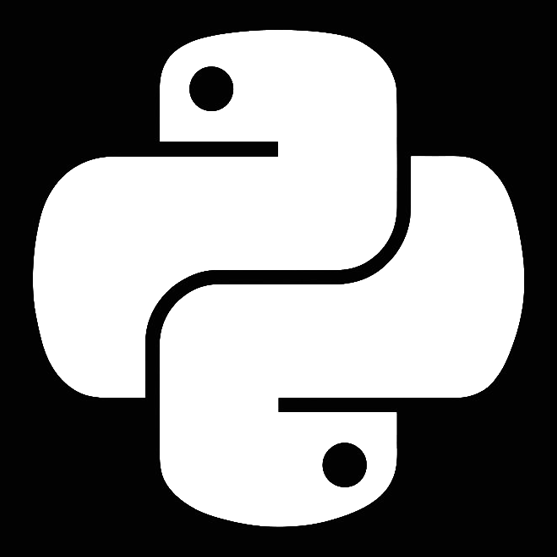
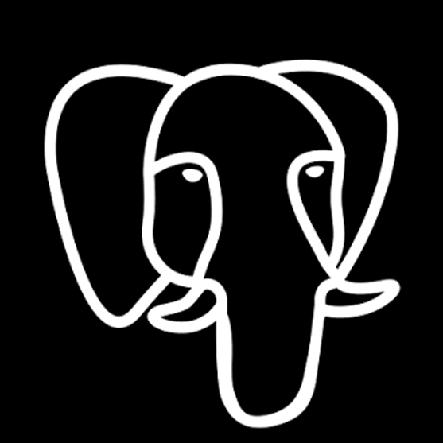
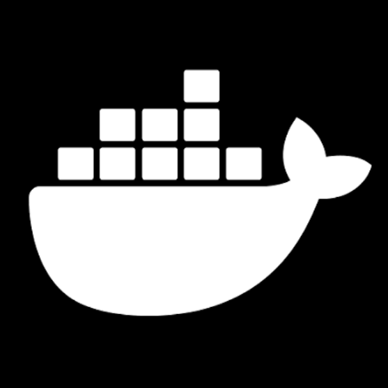
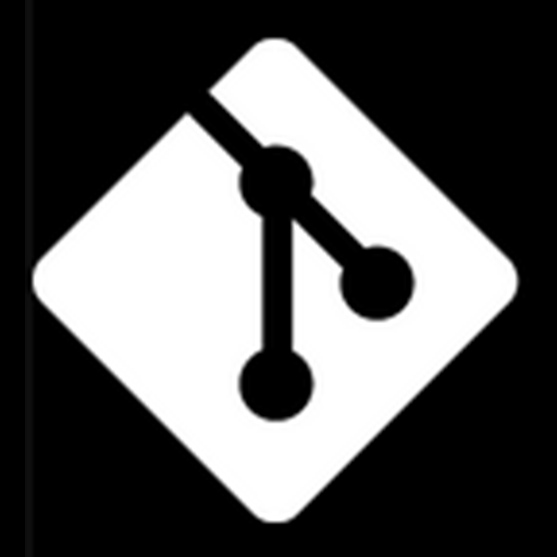
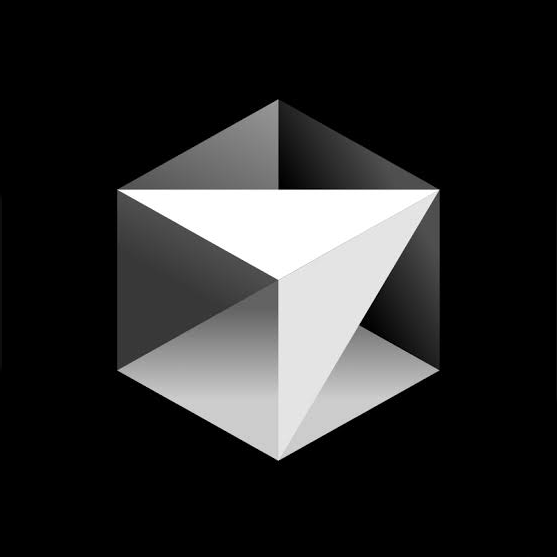

---

# Hola, soy Marianela

### Desarrolladora Full Stack | Desarrollo de Software Asistida por IA
### Análisis Técnico-Funcional | Seguridad de Aplicaciones

Soy Desarrolladora Full Stack con experiencia trabajando de punta a punta sobre aplicaciones empresariales, combinando análisis de requerimientos, desarrollo frontend y backend, APIs, bases de datos, debugging, testing, seguridad y documentación.

Integro Inteligencia Artificial de forma transversal en mi flujo de trabajo para análisis de requerimientos, comprensión de codebases, debugging, análisis de causa raíz, diseño de soluciones, revisión de código, testing y documentación.

Trabajo con foco en soluciones simples, seguras y verificables, validando siempre contra código real, APIs, bases de datos, logs y comportamiento del sistema.

---

<h2 align="center">Tecnologías y Herramientas</h2>

<h3 align="center">Frontend</h3>

  
  &nbsp;&nbsp;
  
  &nbsp;&nbsp;
  
  &nbsp;&nbsp;
  
  &nbsp;&nbsp;
  

<h3 align="center">Backend</h3>

  
  &nbsp;&nbsp;
  
  &nbsp;&nbsp;
  

<h3 align="center">Bases de datos</h3>

  
  &nbsp;&nbsp;
  
  &nbsp;&nbsp;
  

<h3 align="center">Cloud, DevOps y APIs</h3>

  
  &nbsp;&nbsp;
  
  &nbsp;&nbsp;
  
  &nbsp;&nbsp;
  
  &nbsp;&nbsp;
  

<h3 align="center">IA aplicada al desarrollo</h3>

  
  &nbsp;&nbsp;
  

---

### Actividad:

# 📊 GitHub Stats

 

 

---

### 🔝 Top Contributed Repo

---

## 🏆 GitHub Trophies

---

<a href="https://next.ossinsight.io/widgets/official/compose-user-dashboard-stats?user_id=135768183" target="_blank" style="display: block" align="center">
  <picture>
    <source media="(prefers-color-scheme: dark)" srcset="https://next.ossinsight.io/widgets/official/compose-user-dashboard-stats/thumbnail.png?user_id=135768183&image_size=auto&color_scheme=dark" width="771" height="auto">
    
  </picture>
</a>

---

