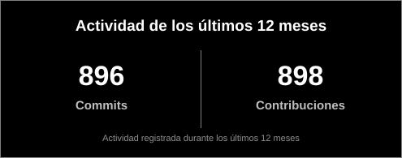
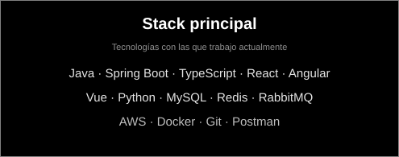
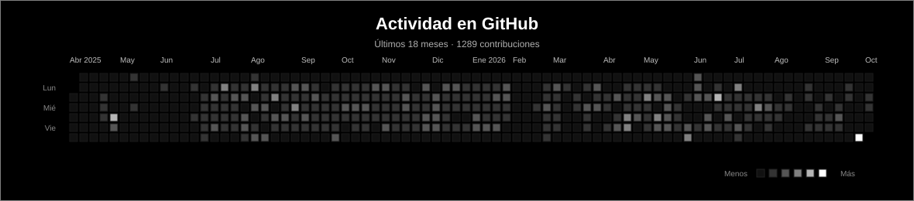
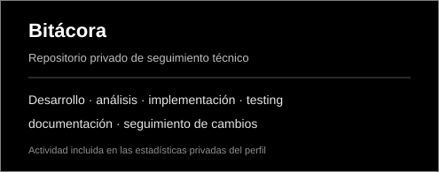

<h1>Hola, soy Marianela 👋</h1>

<h2>
  <strong>Full Stack Developer</strong> ·
  <strong>Software Development with AI</strong> ·
  <strong>Technical & Functional Analysis</strong>
</h2>

<h3>
  Desarrollo de software · Seguridad de aplicaciones · Automatización · IA aplicada
</h3>

 

  

<h3>Desarrollo de punta a punta · IA aplicada · Seguridad</h3>

  Soy <strong>Full Stack Developer</strong> y disfruto trabajar en soluciones de punta a punta,
  desde el análisis del problema hasta la implementación, las pruebas y la documentación.

  Trabajo con <strong>frontend, backend, APIs y bases de datos</strong>,
  integrando <strong>Inteligencia Artificial</strong> como parte de mi flujo diario
  para analizar código, investigar errores, diseñar soluciones, automatizar tareas
  y mejorar procesos de desarrollo.

  Me interesa especialmente entender cómo funciona cada sistema en profundidad,
  combinando <strong>análisis técnico y funcional, debugging, seguridad y testing</strong>
  para construir soluciones simples, seguras y mantenibles.

 

<code>ANALYZE</code>
&nbsp;•&nbsp;
<code>BUILD</code>
&nbsp;•&nbsp;
<code>DEBUG</code>
&nbsp;•&nbsp;
<code>TEST</code>
&nbsp;•&nbsp;
<code>DOCUMENT</code>

---

<h2 align="center">Tecnologías y Herramientas</h2>

<h3 align="center">Frontend</h3>

  
  &nbsp;&nbsp;
  
  &nbsp;&nbsp;
  
  &nbsp;&nbsp;
  
  &nbsp;&nbsp;
  

<h3 align="center">Backend</h3>

  
  &nbsp;&nbsp;
  
  &nbsp;&nbsp;
  

<h3 align="center">Bases de datos</h3>

  
  &nbsp;&nbsp;
  
  &nbsp;&nbsp;
  

<h3 align="center">Cloud, DevOps y APIs</h3>

  
  &nbsp;&nbsp;
  
  &nbsp;&nbsp;
  
  &nbsp;&nbsp;
  
  &nbsp;&nbsp;
  

<h3 align="center">IA aplicada al desarrollo</h3>

  
  &nbsp;&nbsp;
  

---

<h2 align="center">GitHub Stats</h2>

  

  

  

  

---

  

---

<h2 align="center">Repositorio destacado</h2>

  

---

<h2 align="center">Panel de Actividad</h2>

  

